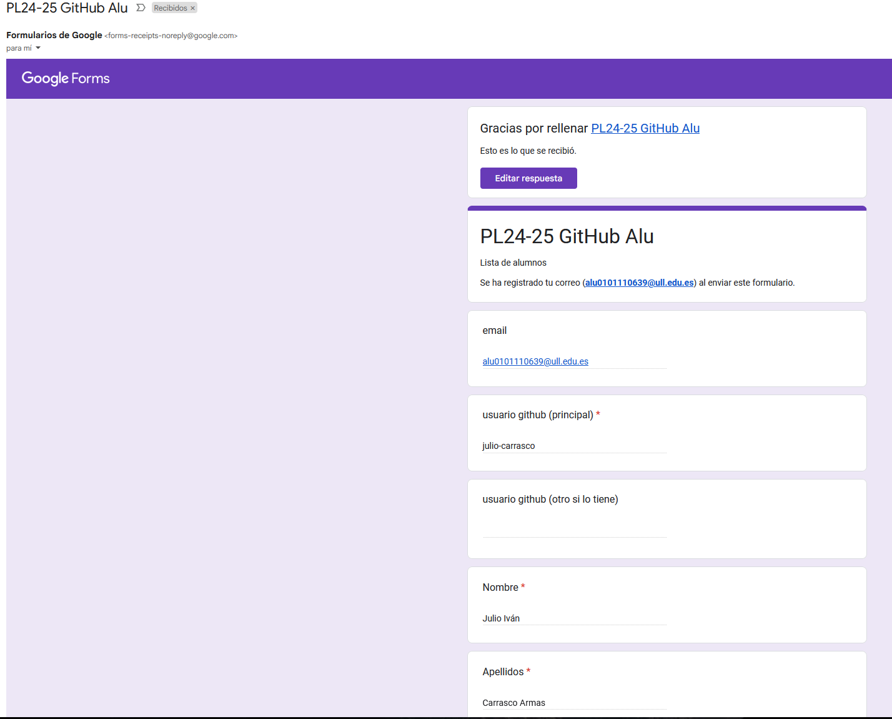
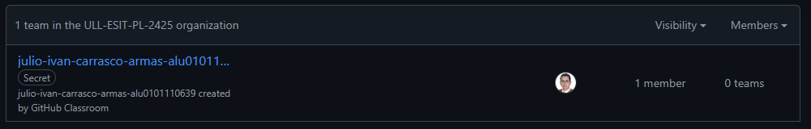
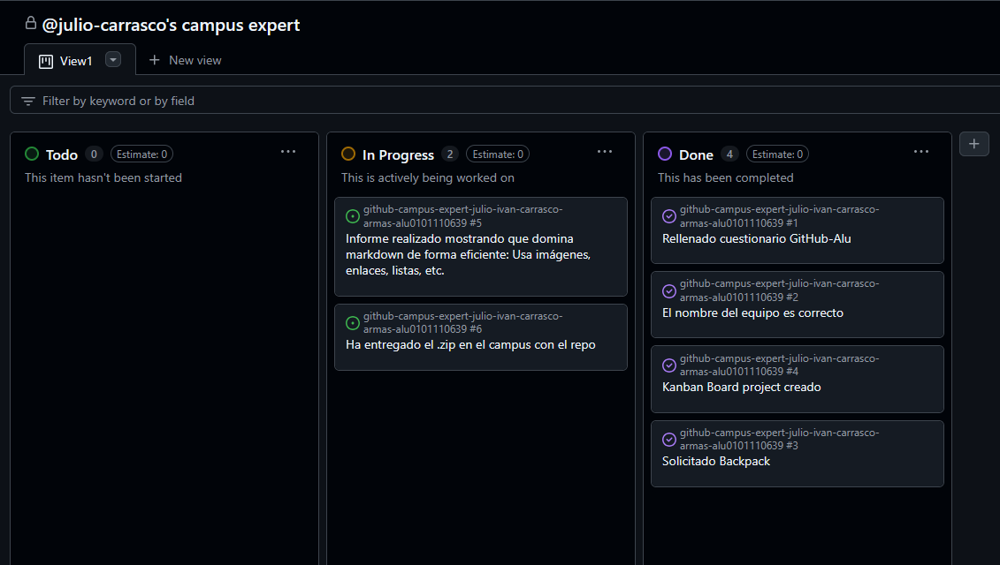
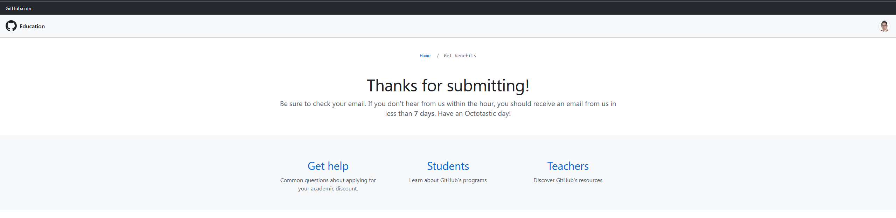

# Github Campus Expert 

- Julio Iván
- Carrasco Armas
- alu0101110639

## Rellenar el cuestionario GitHub-Alu del campus virtual y recibir el correo confirmándolo

## Crear equipo con nombre correcto

[enlace al grupo](https://github.com/orgs/ULL-ESIT-PL-2425/teams/julio-ivan-carrasco-armas-alu0101110639)

## Crear un project board kanban para este repositorio

## Solicitar el GitHub Backpack

Ya lo tenía de otro año, pero se me caducó y lo he vuelto a solicitar, lo que tarda un tiempo en decirme si me lo aprueban

